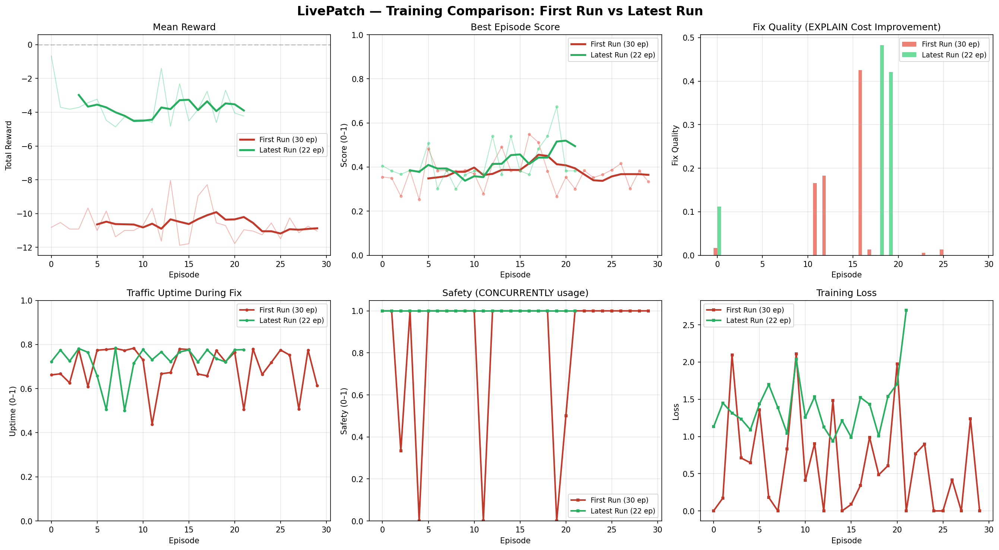

# LivePatch: Database Incident Response Under Live Traffic

An RL environment where an agent must diagnose and fix PostgreSQL database incidents — while production traffic keeps flowing. One wrong move and requests start failing.

## The Problem

Every DBA knows the terror: your database is on fire, the pager is screaming, and you need to fix it **without taking down production**. `CREATE INDEX` locks the table. `VACUUM FULL` blocks all reads. The fix that resolves the alert might cause the outage.

LivePatch simulates this exact scenario. The agent gets a PagerDuty-style alert, a psql terminal, and live traffic hitting the database. It must:

1. **Explore** — `\dt`, `\di`, `pg_stat_activity` to understand the state
2. **Diagnose** — `EXPLAIN ANALYZE` to find the root cause
3. **Fix** — Apply the right fix using safe operations
4. **Submit** — Confirm the fix before the step budget runs out

The catch: `CREATE INDEX` locks the table (downtime!), but `CREATE INDEX CONCURRENTLY` doesn't. `VACUUM FULL` blocks everything, but `VACUUM ANALYZE` is safe. The agent must learn which operations are safe under live traffic.

## Why This Environment Matters

**The database IS the judge.** `EXPLAIN ANALYZE` cost is deterministic — no LLM judge needed, $0 per episode. This makes reward signals:
- Precise (cost went from 15,000 to 50? That's a 0.997 improvement)
- Reproducible (same seed = same incident = same optimal cost)
- Free (no API calls for grading)

**Novel safety constraint.** Most RL environments reward task completion. LivePatch penalizes you for *how* you complete it. A fix that causes 30 seconds of downtime scores worse than no fix at all — just like production.

## Architecture

```
Agent ──psql command──▶ SimulatedDatabase ──observation──▶ Agent
                              │
                        ┌─────┴─────┐
                   TrafficSim    CostModel
                   (QPS/SLA)    (EXPLAIN)
                        │           │
                    uptime       fix_quality
                    score          score
```

No real PostgreSQL needed. The entire database is simulated in-process:
- **20+ psql commands** via regex dispatch (`\dt`, `\di`, `EXPLAIN`, `CREATE INDEX CONCURRENTLY`, `VACUUM ANALYZE`, `pg_stat_activity`, etc.)
- **Cost model** with index scan vs seq scan, bloat multiplier, stats penalty, sort spill to disk
- **Traffic simulation** with connection limits and lock checking
- **8 fault types**: missing_index, lock_storm, table_bloat, bad_config, connection_flood, runaway_query, stale_stats, sort_spill

## Fault Types

| Fault | What Breaks | Safe Fix | Unsafe Fix |
|-------|------------|----------|------------|
| missing_index | Seq scan on 1M rows | `CREATE INDEX CONCURRENTLY` | `CREATE INDEX` (locks table) |
| table_bloat | 3x table size, slow scans | `VACUUM ANALYZE` | `VACUUM FULL` (blocks all) |
| lock_storm | Queries blocking each other | `pg_terminate_backend` | Killing wrong PIDs |
| bad_config | work_mem too low, spilling | `ALTER SYSTEM SET` + `pg_reload_conf` | Restart required |
| connection_flood | Pool exhausted | Kill idle connections | Nothing (wait it out) |
| runaway_query | One query eating all CPU | `pg_cancel_backend` | Let it run |
| stale_stats | Planner picks wrong plan | `ANALYZE` | Nothing (stale forever) |
| sort_spill | Sorts going to disk | Increase work_mem | Nothing |

## Difficulty Tiers

| Tier | Faults | Steps | Traffic | Example |
|------|--------|-------|---------|---------|
| Easy | 1 | 20 | 50 rps | Missing index on `users.email` |
| Medium | 2 | 30 | 100 rps | Bloat + stale stats |
| Hard | 3 | 35 | 200 rps | Lock storm + missing index + bad config |
| Expert | 4 | 40 | 500 rps | Everything at once |

## Scoring

Episodes are graded on 4 axes (weighted sum = final score):

| Metric | Weight | What It Measures |
|--------|--------|-----------------|
| Fix Quality | 35% | EXPLAIN cost improvement (before vs after) |
| Uptime | 30% | Fraction of traffic that succeeded during fix |
| Efficiency | 20% | Steps used vs budget |
| Safety | 15% | Ratio of safe operations (CONCURRENTLY, ANALYZE) |

## Training Results

Trained **Qwen2.5-1.5B-Instruct** with GRPO on A100 GPU using Unsloth + QLoRA (4-bit, r=32).

**Configuration:**
- 50 episodes, GROUP_SIZE=6, LR=1e-4, batched inference
- Adversarial curriculum: easy (0-19) → medium (20-34) → hard (35-49)
- Anti-collapse detection with dynamic temperature scaling
- Trainable params: 36.9M (of 1.5B total)

**Baselines vs Trained Agent (easy difficulty):**

| Agent | Score | Fix Quality | Uptime | Safety |
|-------|-------|------------|--------|--------|
| Random | 0.60 | 0.00 | 0.66 | 0.50 |
| Heuristic | 0.65 | 0.00 | 0.78 | 1.00 |
| **GRPO (best ep)** | **0.63** | **0.54** | **0.71** | **1.00** |

**Key findings:**
1. **Safety learned first** — safety score reached 1.0 within 5 episodes. The model learned `CREATE INDEX CONCURRENTLY` over `CREATE INDEX`, and `VACUUM ANALYZE` over `VACUUM FULL`.
2. **Fix quality is the frontier** — the model achieved fix=0.54 (ep 13) by learning to diagnose with `EXPLAIN ANALYZE` before applying fixes. However, this capability is unstable and collapses to safe-but-passive policies.
3. **Batched inference 6x speedup** — running GROUP_SIZE=6 episodes in parallel via batched generation reduced episode time from ~400s to ~50s on A100.
4. **Reward signal insight** — diagnostic commands (\\dt, EXPLAIN) receive zero per-step reward, creating a sparse reward problem. Future work should add shaping rewards for exploration.



## Quick Start

```bash
# Install
pip install flask numpy pyyaml

# Run tests (78 tests)
python -m pytest tests/ -v

# Start the server
python -m server.app

# Try the heuristic agent
python examples/run_random_agent.py
```

### API Endpoints

```
POST /reset    — Start new episode (returns alert + initial observation)
POST /step     — Execute psql command (returns observation + reward)
GET  /state    — Current database state
POST /grade    — Grade completed episode
GET  /health   — Server health check
```

### Python API

```python
from src.environment import LivePatchEnv
from src.config import EnvironmentConfig

env = LivePatchEnv(EnvironmentConfig(difficulty='easy', seed=42))
obs = env.reset()

print(obs['observation'])  # PagerDuty alert + psql prompt

obs = env.step({'command': '\\dt'})           # List tables
obs = env.step({'command': 'EXPLAIN SELECT * FROM users WHERE email = \'test@test.com\''})
obs = env.step({'command': 'CREATE INDEX CONCURRENTLY idx_users_email ON users(email)'})
obs = env.step({'command': 'submit'})          # Done — get final score
```

## Training Notebook

See [training/livepatch_grpo_training.ipynb](training/livepatch_grpo_training.ipynb) — runs on free Colab T4. Uses Unsloth + LoRA (r=32) for efficient fine-tuning.

## Project Structure

```
src/
  config.py          — Tables, queries, indexes, fault types, difficulty tiers
  models.py          — Data models (TableState, IndexState, FaultSpec, etc.)
  database.py        — SimulatedDatabase with 20+ psql command handlers
  fault_injector.py  — 8 fault types with injection + resolution checking
  environment.py     — LivePatchEnv (OpenEnv-compatible reset/step/state)
  tasks.py           — Task presets + grading
  curriculum.py      — Curriculum controller with mastery tracking
server/app.py        — Flask REST API
baseline.py          — Random + heuristic + OpenAI agents
inference.py         — HuggingFace-compatible inference
tests/               — 78 tests
training/            — GRPO training notebook + results
ui/                  — Interactive terminal UI with traffic dashboard
```

## OpenEnv Compatibility

Follows the standard OpenEnv API:
- `openenv.yaml` — Environment manifest
- `reset()` / `step()` / `state()` — Standard RL interface
- `Dockerfile` — Containerized deployment on port 7860
- `inference.py` — HF-compatible agent interface